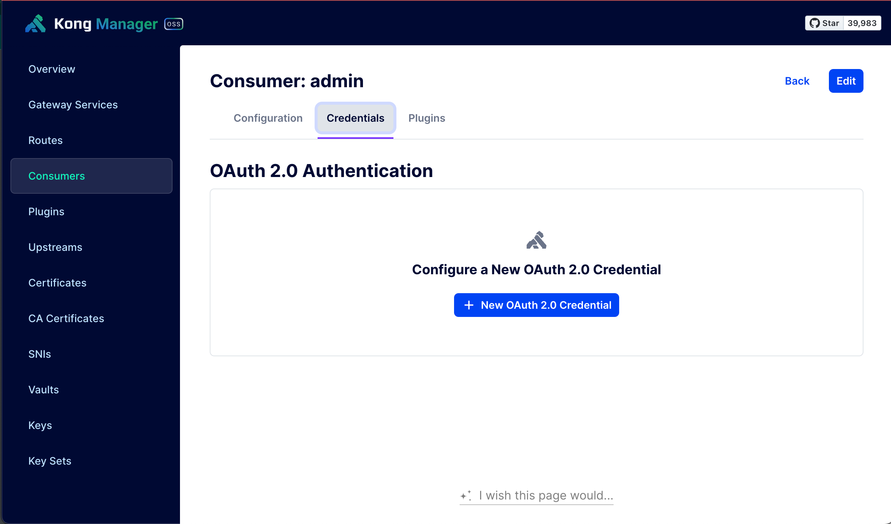
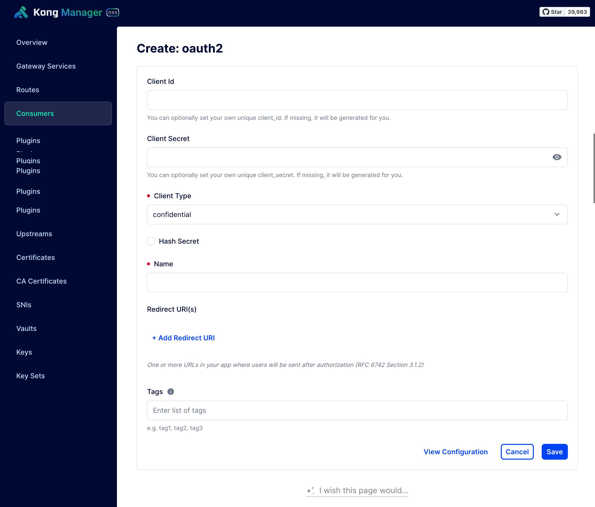
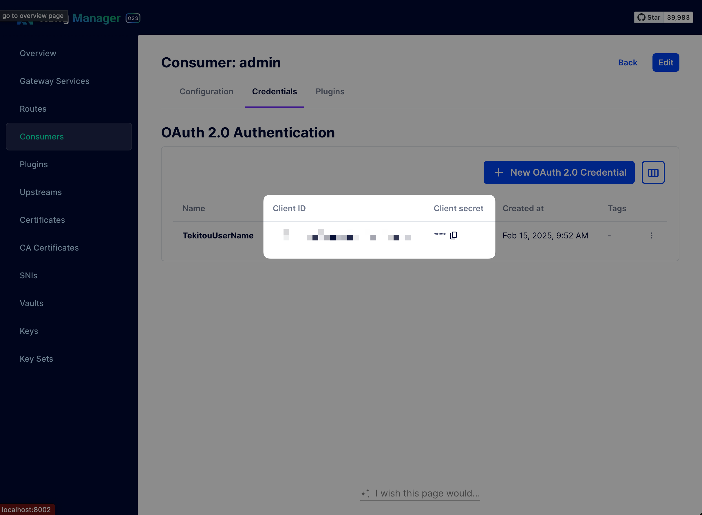

# Client ID と Client secret の取得方法

## 1. Kong ManagerのConsumerページに遷移する

http://localhost:8002/ にアクセスすると、以下のような画面が表示されます。

左側のメニューから `Consumers` をクリックすることで、以下のような画面に遷移します。

ここで、`terraform apply` を行っている場合は `adminユーザー` が一覧に存在しているはずです。（上記スクリーンショットのような表示になるはずです。）

## 2. Credentialのページへの遷移

`adminユーザー` をクリックすると以下のような Consumer詳細が表示されます。

さらに `Credentials` タブを選択することで credentials 一覧ページに遷移します。

## 3. Credentialの発行

`New Auth 2.0 Credential` のボタンをクリックして、以下の作成フォームを表示します。

`Name` の項目に適当な名前を入れて、画面右下の `Save` ボタンをクリックして作成します。

`Client ID` と `Client secret` が発行されるので、こちらを使用してください。
